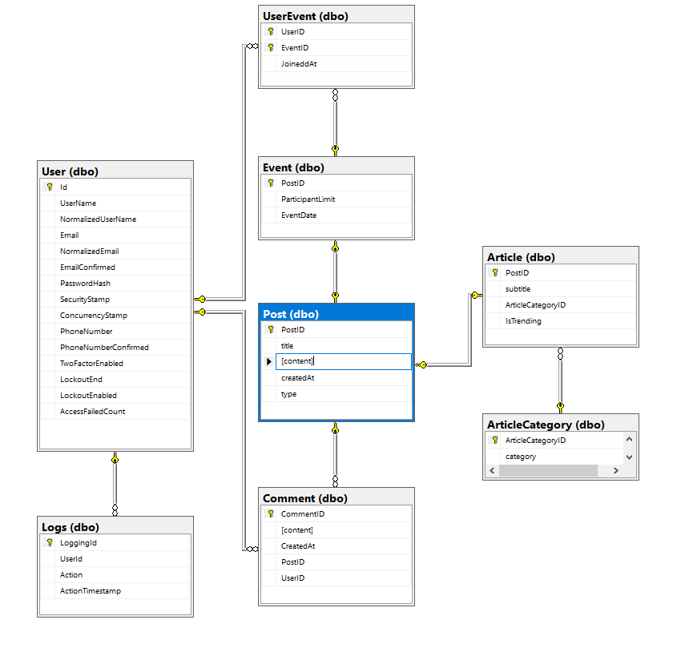

  **Studentko**

Člana ekipe: 
63230226 Mark Novak 
63230280 Jernej Rigler

Glavna naloga sistema Studentko je obveščanje študentov glede dogodkov in diskusije aktualnih tem, ki so povezani z fakulteto/univerzo.
Študenti imajo možnost kreirati nov račun in se prijaviti v sistem. Ko so prijavljeni lahko pregledujejo novice in jih komentirajo ter se prijavljajo na dogodke. V posebnem zavihku imajo koledar, v katerem vidijo prihajajoče dogodke. Admin-i (uredniki) imajo možnost dodajati, spreminjati in brisati dogodke in članke, prav tako imajo temu primeren zavihek za logging, kjer se izpiše kdo je naredil katero akcijo v sistemu.

Članek card:

Navbar:

Dodaj dogodek:

Koledar:

Logging:

Markove(63230226) naloge: večino frontend kode, styling, funkcionalnost koledarja in dogodkov, komentarje, dodajanje dogodkov in člankov.

Jernejeve(63230280) naloge: večina backend kode, avtentikacija, avtorizacija, logging, brisanje in spreminjanje dogodkov in člankov, postavitev na Azure.

Post je abstraktna tabela, katerih elemente podedujeta tako Event, kot Article (1-1 povezava). Vsak ArticleCategory ima lahko več Article-ov, vsak Article ima lahko pa samo en ArticleCategory (1-n povezava). Vsak Post ima lahko več Comment-ov, en Comment pa se navezuje samo na en Post (1-n povezava). User lahko objavi več Comment, vsak Comment pa se navezuje samo na enega User-ja (1-n povezava). User se lahko prav tako prijavi na več Event-ov, vsak Event pa ima lahko več User-jev, zato imamo vmesno tabelo UserEvent (n-m povezava). Vsak User lahko generira več Log-ov, vsak Log pa se navezuje na samo enega User-ja (1-n povezava).
